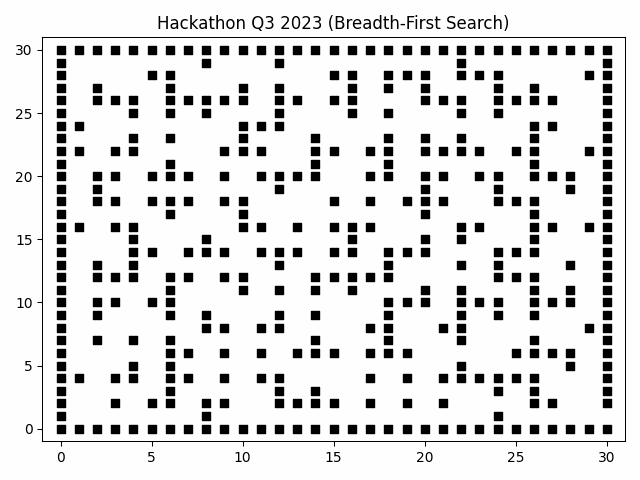

# Sumo Hackathon (2023) Question 3
**Group: Crunch Time (Overall Winners)**

 

Perfect final question solution to Sydney Uni Mechantronics Organisation Annual Hackathon (2023). 
Involves using the matplotlib libraries in combination with a breadth-first search algorithm to find and visually render both the fastest (Left GIF) and the "realistic" (Right GIF) solution to a maze as based on the Maze Runner movies. 
This was a full-marks solution to the final and hardest question, which won the hackathon.

Main code in "MazeRunner.py". Hackathon Brief and Maze Input in "Specifications". Results in "Output". Takes in "maze.txt" as input, and outputs "directions.txt", "BestPath.gif" and "Exploration.gif".

Done in Year 2 Semester 1.

_Alex G_
